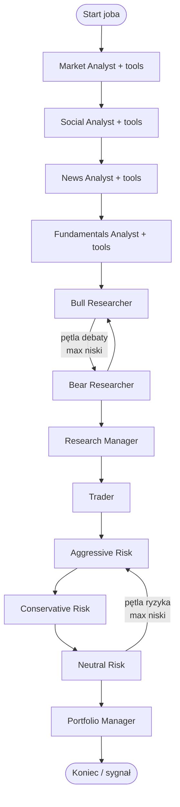
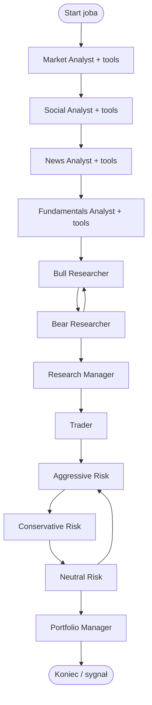

# Proces agentów: BPMN (Mermaid), głębokość analizy, pamięć

Ten dokument opisuje **bieżący** przepływ LangGraph w TradingAgents oraz sposób budowania pamięci kontekstowej. Diagramy są w notacji zbliżonej do BPMN (Mermaid `flowchart` / `subgraph`).

## Gdzie jest kod

- Graf: `tradingagents/graph/setup.py`, logika pętli: `tradingagents/graph/conditional_logic.py`
- Stan: `tradingagents/agents/utils/agent_states.py`
- Pamięć BM25: `tradingagents/agents/utils/memory.py` (`FinancialSituationMemory`)

## Pamięć (memory) — co trafia i na jak długo

- **W ramach jednego joba** agenci bull/bear/trader/research manager/portfolio manager używają instancji `FinancialSituationMemory`: dokumenty tekstowe + BM25 do wybierania `past_memory_str` w promptach.
- **Nie** jest to trwała baza „między jobami”: po zakończeniu procesu instancje są zwalniane wraz z grafem. Kolejny raport startuje **bez** automatycznego wczytania pamięci z poprzedniego zadania.
- **Trwały ślad** wyników: zapis joba w SQLite (`analysis_jobs.result_json`, `progress_json`) oraz artefakty transparentności (JSON przy wywołaniach LLM) — to osobna warstwa od BM25.

## Różnice głębokości (UI „Run in background”)

Parametry `max_debate_rounds` i `max_risk_discuss_rounds` sterują liczbą przejść w pętlach debaty inwestycyjnej (Bull ↔ Bear) oraz ryzyka (Aggressive ↔ Conservative ↔ Neutral). Im wyższa wartość, tym więcej wymian zanim węzeł przejdzie do Research Manager / Portfolio Manager.

W panelu **History** oba limity są ustawiane łącznie z polem `research_depth`:

- **shallow** → `max_debate_rounds = max_risk_discuss_rounds = 1`
- **medium** → oba `= 2`
- **deep** → oba `= 3`

Topologia grafu (kolejność analityków → debata → trader → ryzyko → PM) **nie zmienia się** — zmienia się wyłącznie **licznik warunkowy** w `ConditionalLogic`.

---

## Diagram: shallow

## Diagram: medium

Ten sam układ węzłów; **dłuższe** pętle Bull↔Bear oraz Aggressive↔Conservative↔Neutral względem shallow (większy limit przejść zanim wyjście do Research Manager / Portfolio Manager).

## Diagram: deep

Identyczna topologia; **najdłuższe** pętle debaty i ryzyka (najwyższe limity przejść).

## Opcjonalny agent `news_web`

Jeśli w konfiguracji joba `enable_news_web_agent: true`, do listy analityków dokładany jest węzeł **News Web Agent** (RSS) w tej samej **sekwencji** co pozostali (pozycja zależy od kolejności w tablicy `analysts`).

## Kontrakt wyjść / placeholdery

- Lista placeholderów w promptach: endpoint `GET /api/prompts/placeholders` (źródło: `tradingagents/prompts/placeholders_registry.py`).
- Mapa slotów wyjściowych (tekst w `AgentState`, przyszły JSON wielopolowy): `GET /api/prompts/output-contract` (`tradingagents/prompts/agent_output_graph.py`).
